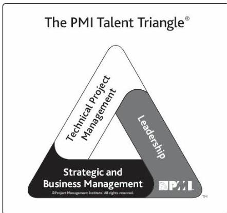

to specific domains of project, program, and portfolio management. The technical aspects of performing one's role.

- Leadership. The knowledge, skills, and behaviors needed to guide, motivate, and direct a team, to help an organization achieve its business goals.
- Strategic and business management. The knowledge of and expertise in the industry and organization that enhanced performance and better delivers business outcomes.

Figure 3-2. The PMI Talent Triangle®

While technical project management skills are core to program and project management, PMI research indicates that they are not enough in today's increasingly complicated and competitive global marketplace. Organizations are seeking added skills in leadership and business intelligence. Members of various organizations state their belief that these competencies can support longer-range strategic objectives that contribute to the bottom line. To be the most effective, project managers need to have a balance of these three skill sets.

### 3.4.2 TECHNICAL PROJECT MANAGEMENT SKILLS

83