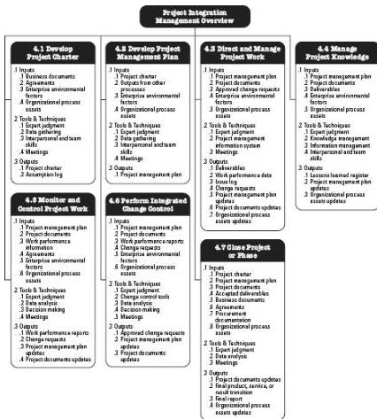

assets, project documents, and the project management plan; and communicating the decisions.

4.7 Close Project or Phase—The process of finalizing all activities for the project, phase, or contract.

Figure 4-1 provides an overview of the Project Integration Management processes. The Project Integration Management processes are presented as discrete processes with defined interfaces while, in practice, they overlap and interact in ways that cannot be completely detailed in the PMBOK® Guide.

Figure 4-1. Project Integration Management Overview

# KEY CONCEPTS FOR PROJECT INTEGRATION MANAGEMENT

Project Integration Management is specific to project managers. Whereas other Knowledge Areas may be managed by specialists (e.g., cost analysis, scheduling specialists, risk management experts), the accountability of Project Integration Management cannot be delegated or transferred. The project manager is the one who combines the results in all the other Knowledge Areas and has the overall view of the project. The project manager is

95