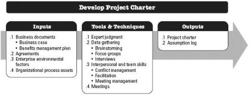
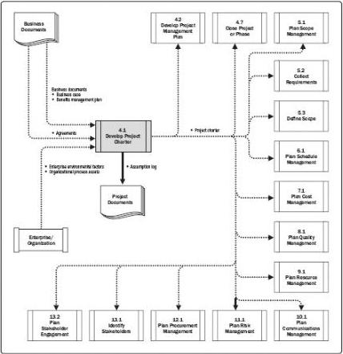

Figure 4-2. Develop Project Charter: Inputs, Tools & Techniques, and Outputs

Figure 4-3. Develop Project Charter: Data Flow Diagram

The project charter establishes a partnership between the performing and requesting organizations. In the case of external projects, a formal contract is typically the preferred way to establish an agreement. A project charter may still be used to establish internal agreements within an organization to ensure proper delivery under the contract. The approved project charter formally initiates the project. A project manager is identified and assigned as early in the project as is feasible, preferably while the project charter is being

99